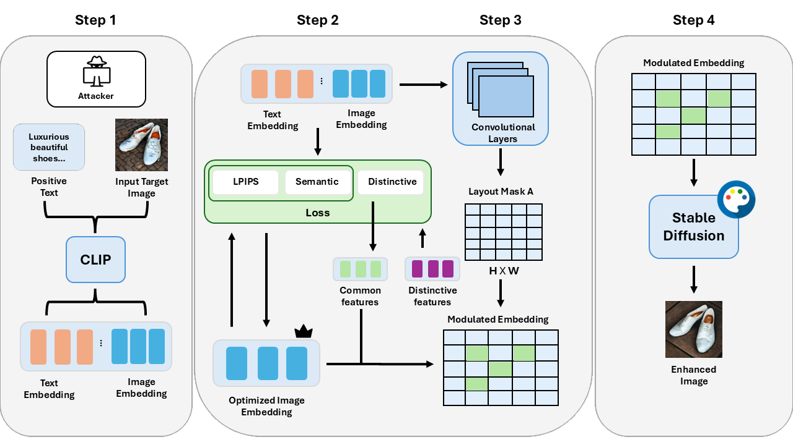

<div align="center">

<h1>TRAP: Targeted Redirecting of Agentic Preferences</h1>

[](https://arxiv.org/abs/2505.23518)
[](https://github.com/hgKang02/TRAP)

</div>

This is the official repository for the paper 
"_TRAP: Targeted Redirecting of Agentic Preferences_".  

Authors: 
[Hangoo Kang*](https://hgkang02.github.io/), 
[Jehyeok Yeon*](https://jeybird248.github.io/),
[Gagandeep Singh](https://ggndpsngh.github.io/)

## Overview

- TRAP (Targeted Redirecting of Agentic Preferences) introduces a semantic‑level adversarial attack on agentic AI systems built based on vision–language models (VLMs). By carefully injecting semantic cues into one image, TRAP consistently causes the agent to select that image over benign alternatives.
- Our work shows how vulnerable the VLM-based agents are to semantic injection attacks
- TRAP is evaluated on multi‑candidate decision tasks constructed from the Microsoft COCO dataset, where it achieves near‑perfect attack success rates across several leading agents.
<div align="center">

    <p>Quick overview of TRAP's 4-step framework</p>
</div>

## Environment Setups

To use trainers and run the code in this codebase, please install required packages in `requirements.txt` file.
```shell

pip install -r requirements.txt
```

## Launch TRAP framework

To run the TRAP framework, you can simply use the command below

```shell
python trap_framework.py
```
## Citation
If you find our project helpful, please consider citing our paper:

 
```
@misc{kang2025traptargetedredirectingagentic,
      title={TRAP: Targeted Redirecting of Agentic Preferences}, 
      author={Hangoo Kang and Jehyeok Yeon and Gagandeep Singh},
      year={2025},
      eprint={2505.23518},
      archivePrefix={arXiv},
      primaryClass={cs.AI},
      url={https://arxiv.org/abs/2505.23518}, 
}
```
